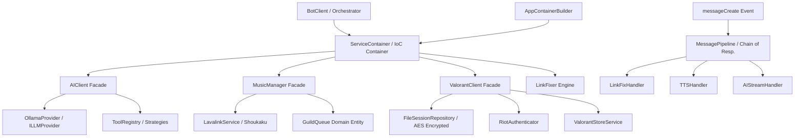

# 🤖 PaiMon-Bot

[](https://nodejs.org/)
[-5865F2.svg)](https://discord.js.org/)
[](#-unit-testing)
[](#-architecture--solid-principles)
[](LICENSE)

**PaiMon-Bot** 是一款基于 `discord.js` v14 (Message Components V2) 构建的下一代全功能 Discord 机器人。内置 **Lavalink 高音质音乐引擎**、**Ollama AI 流式问答与 Function Calling**、**Valorant 每日商店 Canvas 动态渲染** 以及 **社交媒体嵌入修复引擎**。

---

## 🌟 核心功能一览 (Features)

### 🤖 AI 智能问答与多模态 (AI Subsystem)
- **Ollama 本地/云端 LLM 推理**: 支持流式输出（Streaming），适配文本与 Vision 多模态模型 (`llava`)。
- **Function Calling 工具调用**: 基于策略模式 (`ToolRegistry`)，支持 AI 自动进行实时网页搜索（Serper API）与时间查询。
- **平滑编辑防抖队列**: 采用 `DiscordStreamUpdater`，消除 Discord Message Edit Rate Limit (429) 并提供打字思考状态。
- **SDXL 图像生成**: 整合 Hugging Face Inference API，支持由文本 Prompt 合成图片。

### 🎵 Lavalink 高音质音乐 (Music Subsystem)
- **全功能音频播放器**: 基于 `shoukaku` 4.x 驱动，支持 YouTube/SoundCloud 链接解析与关键词搜歌。
- **丰富播放控制**: 支持队列管理 (`GuildQueue`)、单曲/循环模式 (`loop`)、随机播放 (`shuffle`)、音量调节与跳过。
- **TTS 语音插播机制**: 自动在队列中无缝插播文本朗读 (Google TTS)，朗读完毕自动恢复歌曲进度。
- **Message Components V2 UI 卡片**: 精美呈现「正在播放」进度条与播放列表面板。

### 🎮 Valorant 每日商店渲染 (Valorant Subsystem)
- **Canvas 动态图片合成**: 使用 `@napi-rs/canvas` 生成 1600x800 高清商店商品卡片及倒计时 (`StoreCanvas`)。
- **多账号与 RSO 快捷登录**: 支持使用 OAuth/RSO 授权链接安全登录多账号。
- **加密持久化与 Cookie 自动续期**: 会话采用 AES-CBC 256 位加密存储 (`FileSessionRepository`)，Token 过期自动进行 Cookie 无感重刷新。

### 🔗 社交媒体嵌入修复 (LinkFixer Subsystem)
- **多平台链接修复**: 自动修复 TikTok、Douyin (抖音)、Twitter/X、Instagram、Bilibili、Pixiv 链接预览。
- **抖音元数据抓取**: 专用 scraper 自动解析 1080p 无水印短视频流与互动数据。
- **内存安全与互动控制**: 基于 `lru-cache` 追踪已修复消息，支持通过 ❌ 反应一键撤回，🔄 反应切换解析 Source。

### 🛡️ 管理与通用工具 (Admin & Utilities)
- **批量删除/惩罚**: 支持 `/purge` 批量删消息（带 14 天过滤规则）、Kick、Ban、Timeout、Warn/Warnings 记录。
- **频道慢速与锁定**: 支持频道 Slowmode 调节与一键 Lock/Unlock 锁频。
- **TTS 专区频道**: 支持 `/ttschannel` 设置文字频道自动朗读。

---

## 🏗️ 架构设计与 SOLID 原则 (Architecture)

项目严格遵循 **面向对象编程 (OOP)**、**领域驱动设计 (DDD)** 及 **SOLID 原则**：



### 设计模式落地与职责映射

| 设计模式 / 原则 | 核心实现类 | 职责说明 |
| :--- | :--- | :--- |
| **Composition Root** | `AppContainerBuilder` | 集中管理应用服务组装与 IoC 容器注册，落地 **依赖倒置原则 (DIP)**。 |
| **IoC Container** | `ServiceContainer` | 单例服务管理容器，解耦组件创建与依赖获取。 |
| **Chain of Responsibility** | `MessagePipeline` | 消息处理责任链，按优先级流转并消费 `messageCreate` 事件 (`BaseMessageHandler`)。 |
| **Strategy Pattern** | `ILLMProvider`, `BaseTool`, `BaseMetadataScraper` | 抽象 LLM 提供商、AI 工具与网页元数据抓取策略，落地 **开闭原则 (OCP)**。 |
| **Facade Pattern** | `AIClient`, `ValorantClient`, `MusicManager` | 统一封装复杂领域子系统，为指令层提供干净的调用接口。 |
| **Repository Pattern** | `FileSessionRepository` | 隔离 Valorant 账号 Session 的 AES 加密、防抖写盘与内存检索。 |
| **Presenter Pattern** | `BotResponsePresenter`, `MusicPresenter` | 隔离 Discord Message Components V2 UI 卡片渲染逻辑与业务领域。 |
| **Command Router** | `ComponentRouter`, `ReactionRouter` | 统一分发 Discord 按钮/下拉选单/Emoji 反应交互至独立 Handler。 |

---

## 📋 Slash 指令列表 (Commands)

| 分组 | 指令 | 语法与说明 |
| :--- | :--- | :--- |
| **General** | `/ping` | 查看机器人延迟与 API 响应速度 |
| | `/help` | 查看交互式指令帮助面板 |
| | `/about` | 查看系统运行状态、RAM/CPU 占用及 Node 版本 |
| | `/avatar` | 查看成员放大版头像 |
| | `/tts` | 播放单次语音朗读 |
| **Music** | `/play` | `/play [曲名或URL]` - 搜尋并加入高音质歌曲 (支援 YouTube/播放清单) |
| | `/nowplaying` | 查看当前正在播放的歌曲卡片与进度条 |
| | `/queue` | 查看播放队列列表及总时长 |
| | `/skip` / `/stop` | 跳过当前歌曲 / 清空队列并停止 |
| | `/pause` / `/resume` | 暂停播放 / 恢复播放 |
| | `/loop` / `/shuffle` | 循环模式设定 (单曲/队列) / 随机打乱队列 |
| | `/volume` / `/join` | 调整播放音量 (1-100) / 手动加入语音频道 |
| **Valorant**| `/login` | 使用 Riot RSO 授权网址登录账号 |
| | `/store` | 生成并查看 Valorant 每日商店 Canvas 图片 |
| | `/logout` | 登出当前已保存的 Riot 账号 |
| **Admin** | `/purge` | `/purge [1-100] [指定用户]` - 批量删除 14 天内的频道消息 |
| | `/ban` / `/kick` | 封禁成员 / 踢出成员 |
| | `/timeout` / `/warn` | 禁言成员 / 警告成员 (保存于 JSON 数据库) |
| | `/warnings` | 查询成员的历史警告记录 |
| | `/lock` / `/unlock` | 锁定当前频道发文权限 / 解锁频道 |
| | `/slowmode` | 设定频道慢速模式冷却秒数 |
| | `/ttschannel` | 设置当前频道为自动 TTS 朗读频道 |

---

## 📁 项目目录结构 (Project Structure)

```text
PaiMon-Bot/
├── bot-source/
│   ├── index.js                     ← 入口 Bootloader
│   ├── package.json
│   ├── src/
│   │   ├── config.js                ← 全局 UI/AI/Music 常量配置
│   │   ├── builders/                ← ComponentV2CardBuilder (UI 构件)
│   │   ├── commands/                ← Slash 指令目录 (admin, general, music, owner, valorant)
│   │   ├── core/                    ← 核心领域模块
│   │   │   ├── AIClient.js          ← AI 客户端 Facade
│   │   │   ├── BotClient.js         ← Discord Client 编排器
│   │   │   ├── ValorantClient.js    ← Valorant Facade
│   │   │   ├── MusicManager.js      ← 音乐领域服务
│   │   │   ├── StoreCanvas.js       ← Canvas 图片渲染器
│   │   │   ├── ServiceContainer.js  ← DI 容器
│   │   │   ├── ai/                  ← OllamaProvider, ImageSynthesis, SessionManager
│   │   │   ├── bot/                 ← AppContainerBuilder, CommandLoader, Presenter
│   │   │   ├── components/          ← ComponentRouter & Handler
│   │   │   ├── linkfixer/           ← DomainRegistry & LinkProviderRotator
│   │   │   ├── music/               ← GuildQueue, LavalinkService, Song Entity
│   │   │   ├── reactions/           ← ReactionRouter & Reaction Handlers
│   │   │   ├── scrapers/            ← Douyin & OG Metadata Scrapers
│   │   │   ├── tools/               ← ToolRegistry, WebSearchTool, TimeTool
│   │   │   └── valorant/            ← FileSessionRepository, RiotAuthenticator
│   │   ├── events/                  ← Discord 事件监听 (interactionCreate, messageCreate...)
│   │   ├── handlers/                ← AIStreamHandler, LinkFixHandler, TTSHandler
│   │   ├── pipeline/                ← MessagePipeline & BaseMessageHandler
│   │   └── utils/                   ← BaseJsonFileStore, ColorUtils, DiscordSanitizer
│   └── tests/                       ← 原生 Node.js 单元测试套件 (80 个测试用例)
├── docker-compose.yml
├── .env.example
└── README.md
```

---

## 🧪 运行单元测试 (Unit Testing)

项目配套了基于 Node.js 原生测试 runner (`node --test`) 的全量自动化测试：

```bash
cd bot-source
npm test
```

### 测试覆盖范围
- **ServiceContainer & AppContainerBuilder**: 单例工厂注册与 DI 依赖解析
- **GuildQueue & Song**: 播放状态机变化、TTS 插播打断与不可变 Value Object 冻结
- **LinkFixer & LRU Cache**: 内存防爆与失效回退测试
- **Valorant Subsystem**: Session AES 加密解密、Token 解析与登录契约
- **ColorUtils & StoreCanvas**: RGB 通道增益调整与 Hex 转换算法
- **MessagePipeline**: 责任链消费与传递中断

---

## 🚀 环境搭建与部署 (Setup & Deployment)

### 1. 运行环境要求
- **Node.js**: 20.x 或更高版本
- **Lavalink**: 4.x 节点服务器 (可使用 Docker Compose 一键启动)
- **Ollama**: (可选) 用于本地 AI 问答推理

### 2. 环境变量配置
复制 `.env.example` 并重命名为 `.env`：

```bash
cp bot-source/.env.example .env
```

编辑 `.env` 填入配置：

```env
# Discord 凭据
DISCORD_TOKEN=your_bot_token
CLIENT_ID=your_client_id
OWNER_ID=your_discord_user_id

# AI & Ollama 配置
OLLAMA_HOST=http://localhost:11434
OLLAMA_MODEL=gpt-oss:120b-cloud
OLLAMA_VISION_MODEL=llava
SERPER_API_KEY=your_serper_search_api_key
HF_TOKEN=your_huggingface_token

# Lavalink 配置
LAVALINK_HOST=127.0.0.1
LAVALINK_PORT=2333
LAVALINK_PASSWORD=youshallnotpass
```

### 3. 本地直接运行

```bash
cd bot-source
npm install
npm start
```

### 4. Docker Compose 一键部署

```bash
docker compose up -d --build
```

---

## 📄 开源许可证 (License)

本项目采用 [MIT License](LICENSE) 许可证。
